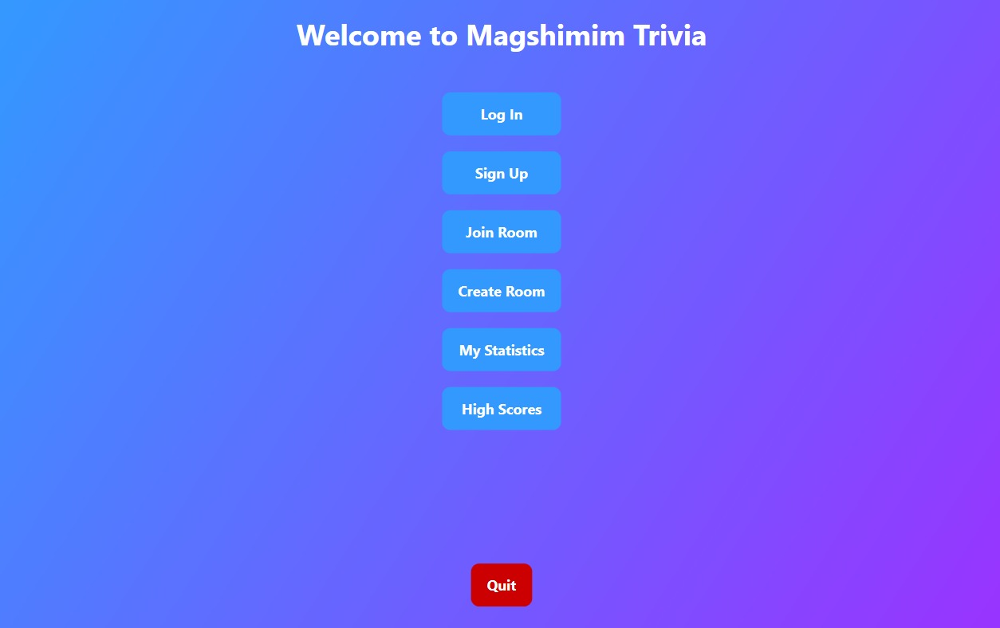

# 🧠 Trivia Game – Multi-language Client-Server Project

This is a full-stack trivia game that combines networking, web APIs, and a graphical user interface.  
The project consists of a C++ server, a C# GUI client, and a Python script that fetches trivia questions from a public API.

---

## 🎯 Overview

- 🖥️ **Client (C#):** Interactive GUI built with WPF. Sends commands and receives questions from the server.
- 💡 **Server (C++):** Handles client connections, manages game sessions, communicates with the Python API handler.
- 🌐 **API Fetcher (Python):** Connects to a public trivia API, parses questions, and returns structured data to the C++ server.

---

## 📷 Screenshots

  
  
  
  
  

---

## 🎓 What I Learned

This project taught me how to build a fully working client-server application that spans multiple programming languages and technologies. Key skills and concepts I developed include:

- **Socket programming in C++** – learned how to create a TCP server, handle client sessions, and parse custom messages
- **Concurrency and thread handling** – understanding how to maintain multiple connections and keep the server responsive
- **Designing a user-friendly GUI in C#** – using Windows Forms to build an interface that interacts with the backend in real time
- **Consuming web APIs with Python** – using the `requests` library to fetch structured trivia questions (JSON), parsing them and returning them to the server
- **Defining a custom protocol** – to communicate between the client and server reliably, including commands, payload structure, and error handling
- **Multi-language integration** – coordinating logic across three languages and making sure each layer (GUI ↔ server ↔ API) connects smoothly
- **Testing and debugging across systems** – understanding the challenges of networking bugs, desynchronization, and data formatting

This project helped me understand how different parts of a system interact – from front-end UX all the way to low-level networking and external APIs.

Note: the project is not finished, some features may not be available
